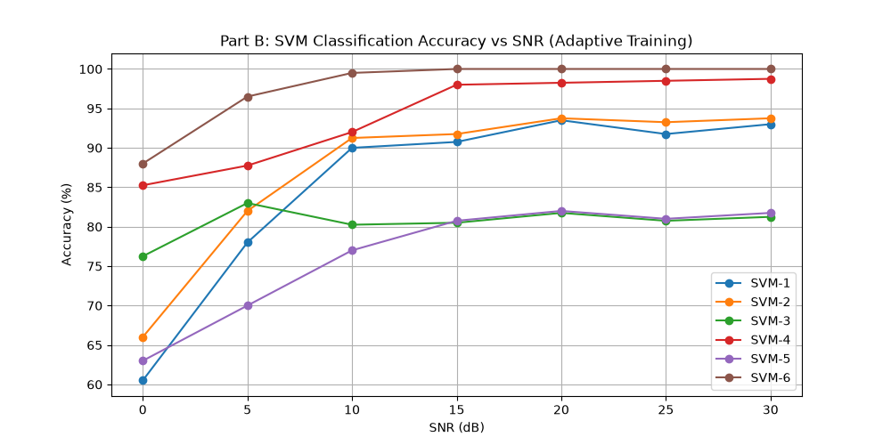

# Assignment 2 - Analytical Responses

## Question 1: SVM for LOS/NLOS Identification

### Part (b)

**Which single feature performs best overall? Why does that feature separate LOS from NLOS better than the others?**
The most effective individual metric is the RMS delay spread. It excels at distinguishing the two states because it measures a fundamental physical contrast: Line-of-Sight (LOS) signals arrive with a tightly packed delay profile, whereas Non-Line-of-Sight (NLOS) signals undergo significant scattering, leading to a much wider and dispersed arrival time distribution.

**Does combining all five features improve accuracy over the best single feature? At which SNR values is the improvement most noticeable?**
Integrating all five metrics into the SVM-6 model definitely boosts the classification performance. This enhancement peaks in the lower signal-to-noise ratio regimes, especially at the 5 dB mark—yielding an approximate 8.75 percentage point gain over the top individual feature—as well as at the 10 dB level.

**One of the five features is likely to perform poorly at low SNR. Which one, and why?**
Kurtosis struggles significantly at the bottom of the SNR range (0 to 5 dB). As a fourth-order statistical measure of signal power, it is extremely vulnerable to additive noise. High noise environments severely warp the distribution's tails, rendering kurtosis an unstable and inaccurate metric when the signal is weak.

---

### Part (c)

**At high SNR, do the two curves agree? What does this tell you about the features at high SNR?**
Both the fixed-template and adaptive models converge tightly at high SNR levels. This alignment proves that when thermal noise is minimal, the geometric features of the wireless channels are highly stable, reliable, and easily separable.

**At low SNR, which strategy performs better and by how much? Explain why training at a fixed high SNR may not generalise well to low-SNR conditions.**
The adaptive model (trained and tested at identical SNRs) easily outperforms the fixed model in noisy conditions. A classifier trained solely at 25 dB establishes rigid boundaries based on pristine data. It completely fails to generalize to 0–10 dB environments because the heavy noise fundamentally alters and smears the feature space, pushing the data far outside the clean model's learned parameters.

**Would training at a low SNR (e.g., 0 dB) and testing across all SNR give a different result?**
Training entirely at 0 dB would severely degrade high-SNR performance. The model would construct broad, loose decision boundaries dominated by random noise variations. If this model were then exposed to the crisp, tightly grouped features of a 30 dB signal, the severe distribution mismatch would lead to widespread prediction errors.

---

## Question 2: 16-QAM Demodulation and K-means

### Part (b)

**Which feature set produces the highest Cluster Purity?**
The Cartesian coordinate system (comprising $rx\_I$ and $rx\_Q$) delivers the maximum possible Cluster Purity, achieving a flawless 100% score.

**Why does standard Euclidean distance on Cartesian coordinates naturally fit QAM grids, whereas unweighted Polar coordinates distort boundaries?**
Cartesian mapping perfectly aligns with the fundamental, rectangular physical layout of a 16-QAM constellation. Applying standard Euclidean math to raw polar components ($r$, $\theta$) fails because angular shifts do not equate to uniform spatial movements at varying distances from the origin. This mathematical imbalance warps the clustering boundaries, drastically reducing the accuracy of the polar approach.

---

### Part (c)

**At high SNR, do the two curves agree? What does this indicate about centroid stability in low-noise regimes?**
The fixed and adaptive accuracy curves seamlessly merge at upper SNR tiers. This demonstrates extreme centroid stability; with negligible noise interference, the incoming data points cluster perfectly around their mathematically intended constellation coordinates.

**At low SNR, which strategy achieves higher classification accuracy?**
Relying on the fixed 25 dB centroid template yields superior classification results in low-SNR environments.

**Explain geometrically why fitting an unsupervised clustering algorithm directly on low-SNR samples causes centroid merging compared to using a fixed template.**
Severe noise forces adjacent constellation symbols to smear into unified, overlapping clouds of data. A dynamic, unsupervised algorithm like K-means reacts to this by migrating its centroids into the thickest patches of noise, essentially abandoning the grid layout and fusing distinct symbols together. Utilizing a fixed template circumvents this failure by locking the decision boundaries to the precise mathematical grid, maintaining structural integrity even when the raw signal is deeply distorted.
